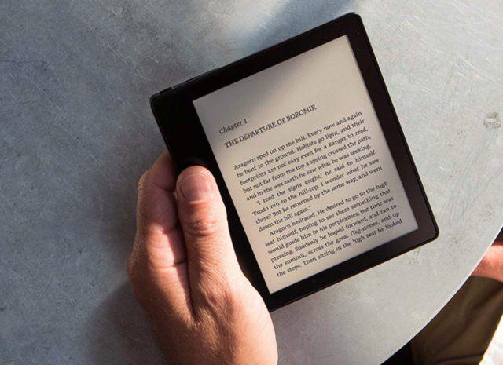
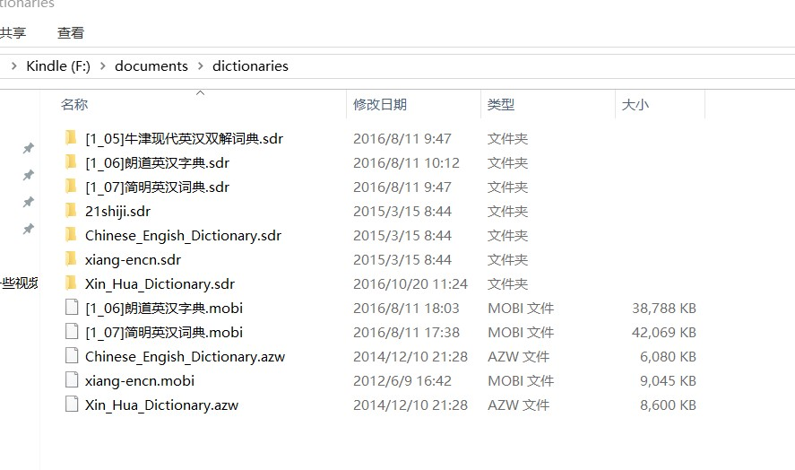

 # kindle 使用技巧分享
 
  
   
     
       
         
           
             
        
  - kindle的介绍
  - kindle与ipad的比较
  - kindle设备管理
  - kindle推书
  - kindle词典管理
 
 ## kindle介绍
kindle是亚马逊一个电子阅读器品牌，目前已经有4个系列。融合亚马逊图书的生态。
 * kindle 
 * kindle paperwrite
 * kindle voyage
 * kindle Oasis

 ## kindle与ipad的比较
 ### kindle优势
 1. 墨水屏，护眼
 2. 续航时间长
 3. 比较小，容易携带，随时阅读
 4. kindle适合的场景小说和漫画,适合户外
 5. kindle全平台覆盖，同步阅读进度
 
 ### ipad优势
 1. 生态丰富
 2. 屏幕大
 3. 更适合技术类书，对排版要求比较高
 
 ## kindle设备管理
  - kindle升级
  - kindle设备管理
 
 ## kindle 推书
 - 邮件推书
 - 书的格式
    - 常见书的格式：txt、pdf、epub 
    - kindle需要的格式；mobi、azw3
 - 转换的方式
    - 邮件主题 convert
    - 通过软件Calibre
    - 网页转换
    
 ## kindle词典管理
 地址 ：https://www.douban.com/group/topic/31690870/?ref=t
 >词典很重要，一个好的词典让你对这个世界多一份理解
 - 如何装入词典
 
 
 ## kindle一些问题的解决方法
 1. 刷新慢
 2. 耗电
 3. 书太多
  
