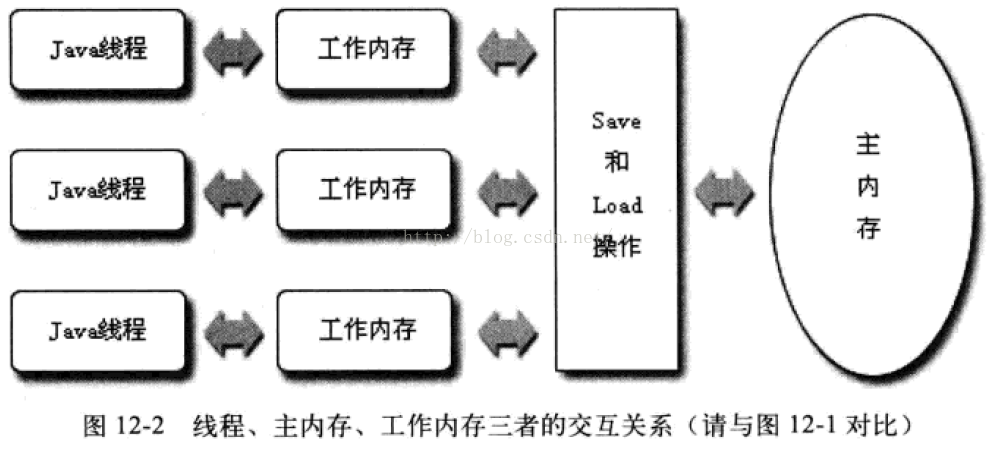
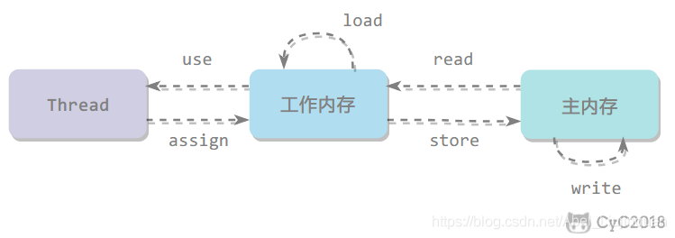
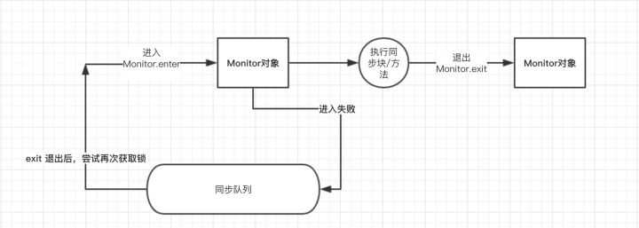
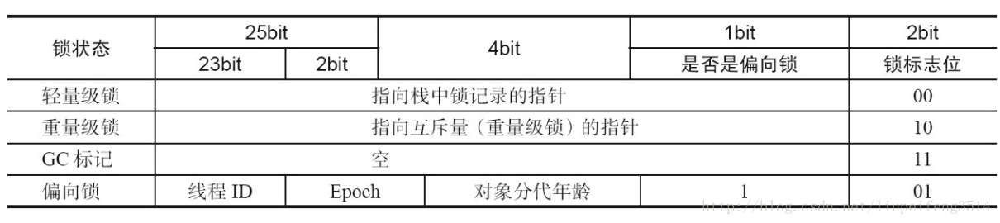
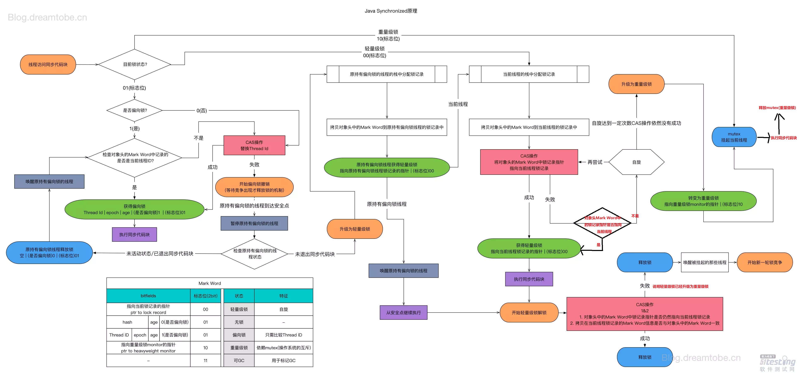
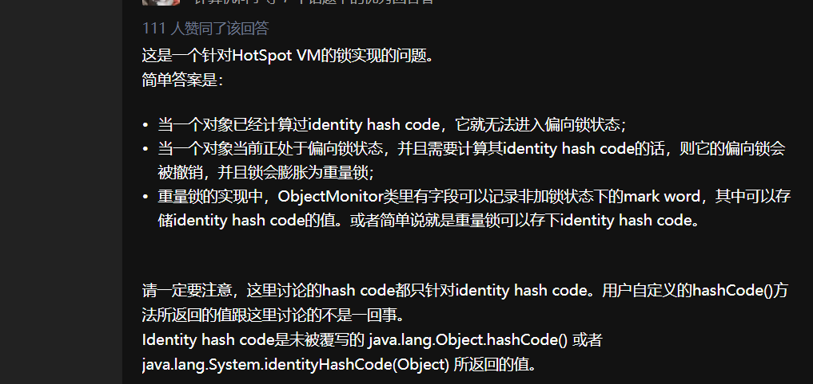

 # synchronized 关键字

  - 特性

    - 可重入

    - jdk1.6以后，性能已经提升很多了，和reentrantLock 持平

 - 分析

    - synchronized 会在同步块分别形成monitorenter 和 monitorexit 两个字节码指令， 这两个字节码都需要一个reference类型的参数来指明要锁定和解锁的对象

    - synchronized是重量级操作，状态转换消耗的时间有可能比用户时间还要长

    - 适应性自旋（Adaptive Spinning）、锁消除（Lock Elimination)、锁粗化（Lock Coarsening）、轻量级（LightWeight Locking） 和偏向锁（Biased Locking）等

    - 内存模型

    -


 - JAVA内存模型
      - 线程、主内存、工作内存三者交互关系
      -   
      - java内存模型定义了8中操作
        - read（读取）：作用于主内存变量，把一个变量值从主内存传输到线程的工作内存中，以便随后的load动作使用
        - load（载入）：作用于工作内存的变量，它把read操作从主内存中得到的变量值放入工作内存的变量副本中。
        - use（使用）：作用于工作内存的变量，把工作内存中的一个变量值传递给执行引擎，每当虚拟机遇到一个需要使用变量的值的字节码指令时将会执行这个操作。
        - assign（赋值）：作用于工作内存的变量，它把一个从执行引擎接收到的值赋值给工作内存的变量，每当虚拟机遇到一个给变量赋值的字节码指令时执行这个操作。
        - store（存储）：作用于工作内存的变量，把工作内存中的一个变量的值传送到主内存中，以便随后的write的操作。
        - write（写入）：作用于主内存的变量，它把store操作从工作内存中一个变量的值传送到主内存的变量中。
        - lock：作用于主内存的变量，把一个变量标识为一条线程独占的状态
        - unlock : 作用于主内存变量，它把一个处于锁定状态的变量释放出来，释放后的变量才可以被其他线程锁定
       
   - 交互图
      
     
  - 可知
     - 有序性
     - 可见性
     - 可预见
  ## syn 重量级锁
- 状态转换消耗的时间可能比用户代码执行的时间还要长

  ### syn锁的过程

- 执行monitorenter,尝试获取对象锁， 如果对象的锁，如果对象没有被锁定，或者当前对象已经拥有对象的锁，把锁的计数加1
- 当没有阻塞
    - 执行代码
- 当阻塞
    - 进行线程上下文切换，jvm和操作系统进行介入（系统调用代价高，需要在用户态和内核态中来回切换）
    - 当前线程挂起，进入阻塞
    - cpu切换其他线程，加载数据到工作内存
    - 当锁释放，又被唤醒，抢占锁
    - 获取锁，重新加载数据到工作内存，执行，
    - 频繁阻塞，无法使用完整调度时间片
- 释放锁
- 执行monitorexit，锁计数器减1

    - 内存栅栏，是缓存无效，刷新硬件地写缓冲，以及停止执行管道，无法排序优化

  ## 锁优化
    - 适应性自旋（Adaptive Spinning）、锁消除（Lock Elimination)、锁粗化（Lock Coarsening）、轻量级（LightWeight Locking） 和偏向锁（Biased Locking）等
      - 自旋
        - 锁定状态只持续了很短的时间
        - 线程空循环
        - 自适应的自旋锁
      - 锁消除
        - 无用的同步处理
        ```
            User use =  new User();
            user.addScore();
        ```
      - 锁粗化
        ```
            List<String> stooges = new vector<String>();
            stooges.add("a");
            stooges.add("b");
            return stooges.toString();
        ```
      - 轻量级锁
        - 对象头的存储
          
        - 对象头由两部分信息，对象自身的运行时数据，Mark world; 指向方法区对象类型数据的指针
      - 当两个做竞争，如何确保正在执行的线程是怎么修改的
     
      - 总结
        
   
  - syn 地使用
   - 对象内地多个方法加，synchronized，就会互相阻塞，可以使用同步块
   - syn锁定的是对象引用，
   - 静态方法加锁 是给class类上锁
     非静态方法加锁 是给对象上锁
  - 代码地优化
    - 缩小锁地范围
    - 减少锁地持有时间
    - 降低所得请求频率
    - 使用带有协调机制的独占锁，使用readWriteLock，这些机制允许更高地并发性
    - 减小锁地粒度
    - 锁分段
    - 使用原子类, AtomicInteger
    - 通常，对象分配操作的开销比同步的开销更低
    

ps :
    
    