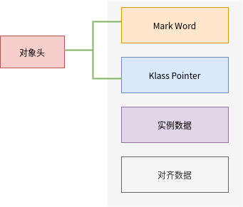
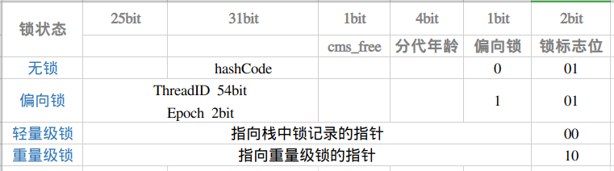
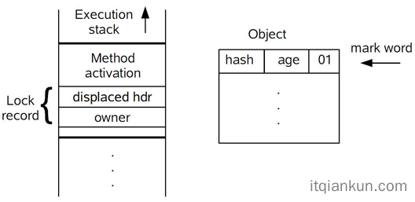

 # synchronized 关键字

 - JAVA内存模型
      - 线程、主内存、工作内存三者交互关系
      -   
      - java内存模型定义了8中操作
        - read（读取）：作用于主内存变量，把一个变量值从主内存传输到线程的工作内存中，以便随后的load动作使用
        - load（载入）：作用于工作内存的变量，它把read操作从主内存中得到的变量值放入工作内存的变量副本中。
        - use（使用）：作用于工作内存的变量，把工作内存中的一个变量值传递给执行引擎，每当虚拟机遇到一个需要使用变量的值的字节码指令时将会执行这个操作。
        - assign（赋值）：作用于工作内存的变量，它把一个从执行引擎接收到的值赋值给工作内存的变量，每当虚拟机遇到一个给变量赋值的字节码指令时执行这个操作。
        - store（存储）：作用于工作内存的变量，把工作内存中的一个变量的值传送到主内存中，以便随后的write的操作。
        - write（写入）：作用于主内存的变量，它把store操作从工作内存中一个变量的值传送到主内存的变量中。
        - lock：作用于主内存的变量，把一个变量标识为一条线程独占的状态
        - unlock : 作用于主内存变量，它把一个处于锁定状态的变量释放出来，释放后的变量才可以被其他线程锁定
       
   - 交互图
      
     
  - 可知
     - 有序性
     - 可见性
     - 可预见
  ## syn 重量级锁
- 状态转换消耗的时间可能比用户代码执行的时间还要长

  ### syn锁的过程

- 执行monitorenter,尝试获取对象锁， 如果对象的锁，如果对象没有被锁定，或者当前对象已经拥有对象的锁，把锁的计数加1
- 当没有阻塞
    - 执行代码
- 当阻塞
    - 进行线程上下文切换，jvm和操作系统进行介入（系统调用代价高，需要在用户态和内核态中来回切换）
    - 当前线程挂起，进入阻塞
    - cpu切换其他线程，加载数据到工作内存
    - 当锁释放，又被唤醒，抢占锁
    - 获取锁，重新加载数据到工作内存，执行，
    - 频繁阻塞，无法使用完整调度时间片
- 释放锁
- 执行monitorexit，锁计数器减1

    - 内存栅栏，是缓存无效，刷新硬件地写缓冲，以及停止执行管道，无法排序优化

  ## 锁优化
    - 适应性自旋（Adaptive Spinning）、锁消除（Lock Elimination)、锁粗化（Lock Coarsening）、轻量级（LightWeight Locking） 和偏向锁（Biased Locking）等
      - 自旋
        - 锁定状态只持续了很短的时间
        - 线程空循环
        - 自适应的自旋锁
      - 锁消除
        - 无用的同步处理
        ```
            User use =  new User();
            user.addScore();
        ```
      - 锁粗化
        ```
            List<String> stooges = new vector<String>();
            stooges.add("a");
            stooges.add("b");
            return stooges.toString();
        ```
     - 对象头的存储
       - 对象头由两部分信息，对象自身的运行时数据，Mark world; 指向方法区对象类型数据的指针
       - 第一部分用于存储对象自身的运行时数据，如哈希码（HashCode）、GC 分代年龄、锁状态标志、线程持有的锁、偏向线程 ID、偏向时间戳、对象分代年龄，这部分信息称为“Mark Word”；Mark Word 被设计成一个非固定的数据结构以便在极小的空间内存储尽量多的信息，它会根据自己的状态复用自己的存储空间。
       - 第二部分是类型指针，即对象指向它的类元数据的指针，虚拟机通过这个指针来确定这个对象是哪个类的实例；
       - 如果对象是一个 Java 数组，那在对象头中还必须有一块用于记录数组长度的数据。因为虚拟机可以通过普通 Java 对象的元数据信息确定 Java 对象的大小，但是从数组的元数据中无法确定数组的大小。
          
          
     - 轻量级锁
        1. 在代码进入同步块的时候，如果同步对象锁状态为偏向状态（就是锁标志位为“01”状态，是否为偏向锁标志位为“1”），虚拟机首先将在当前线程的栈帧中建立一个名为锁记录（Lock Record）的空间，用于存储锁对象目前的Mark Word的拷贝。官方称之为 Displaced Mark Word（所以这里我们认为Lock Record和 Displaced Mark Word其实是同一个概念）。这时候线程堆栈与对象头的状态如图所示
       
        2. 拷贝对象头中的Mark Word复制到锁记录中。
        3. 拷贝成功后，虚拟机将使用CAS操作尝试将对象头的Mark Word更新为指向Lock Record的指针，并将Lock record里的owner指针指向对象头的mark word。如果更新成功，则执行步骤（4），否则执行步骤（5）。
        4. 如果这个更新动作成功了，那么这个线程就拥有了该对象的锁，并且对象Mark Word的锁标志位设置为“00”，即表示此对象处于轻量级锁定状态，这时候线程堆栈与对象头的状态如下所示：
    - 偏向锁
        1. 检查 mark word 的线程 id 。
        2. 如果为空则设置 CAS 替换当前线程 id。如果替换成功则获取锁成功，如果失败则撤销偏向锁。
        3. 如果不为空则检查 线程 id为是否为本线程。如果是则获取锁成功，如果失败则撤销偏向锁。
    - 锁状态升级流程
        
      - 整体流程
        
   
  - syn 地使用
    - 对象内地多个方法加，synchronized，就会互相阻塞，可以使用同步块
    - syn锁定的是对象引用，
    - 静态方法加锁 是给class类上锁
    - 非静态方法加锁 是给对象上锁
  - 代码地优化
    - 缩小锁地范围
    - 减少锁地持有时间
    - 降低所得请求频率
    - 使用带有协调机制的独占锁，使用readWriteLock，这些机制允许更高地并发性
    - 减小锁地粒度
    - 锁分段
    - 使用原子类, AtomicInteger
    - 通常，对象分配操作的开销比同步的开销更低
    

## ps :

