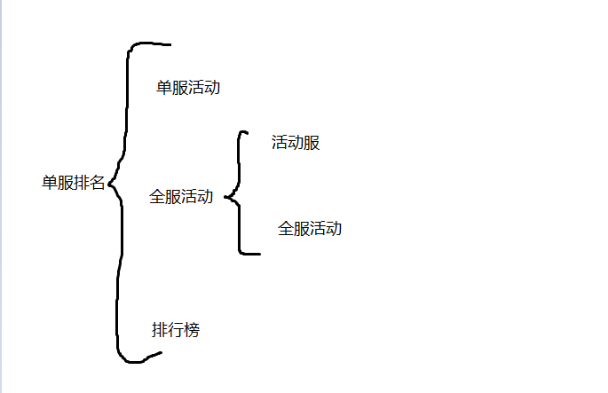

 # 服务器活动排行榜

  
  
  
  ## 火鸡活动 , 单服排名 + 单服活动
  - 使用了框架
  - 存储方式
   数据库存储，map缓存，缓存懒加载的方式
  - 排行榜
   通过map缓存获取。通过stream sort Comparator.comparingLong 。相同积分，根据积分时间比较
   
 ## 单人活动   单服排名 + 全活动服
  - 存储方式
    数据库存储，map和list 缓存.启动全部加载
  - 积分
    阶段积分，map存储。实现Comparable接口。
    总积分，list存储。实现Comparable接口。
  - 排行榜
    阶段积分，通过stream.sorted排序。
    总积分，每次加积分，Collections.sort排序。
  - 历史排行榜
    每次活动结束，放入数据库
  - 跨服加积分
    通过rmi调用
  - 玩家重复出现在排行榜
  ```
        private static SortedSet<UserScore> scoreRankSet = Collections.synchronizedSortedSet(new TreeSet<>());//阶段积分排名
        List<UserScore> list = new ArrayList<>();
        
  		UserScore userScore = new UserScore();
  		userScore.setUid("111111111");
  		userScore.setScore(1L);
  		
  		UserScore userScore1 = new UserScore();
  		userScore1.setUid("222222222");
  		userScore1.setScore(2L);
        // 放入list
  		list.add(userScore);
  		list.add(userScore1);
  
        // 放入map
  		Map<String, UserScore> map = new HashMap<>();
  		for (UserScore score:list) {
  			map.put(score.getUid(), score);
  		}
  		Collections.sort(list);
  		
  		for (int i = 0; i< list.size(); i++) {
  			scoreRankSet.add(list.get(i));
  		}
  		
  		UserScore myScore = map.get("111111111");
  		myScore.setScore(33L);
  		System.out.println(scoreRankSet.size());
  ```
  - TreeSet add方法,使用了treeMap的put方法
  ```
   public V put(K key, V value) {
          Entry<K,V> t = root;
          if (t == null) {
              compare(key, key); // type (and possibly null) check
  
              root = new Entry<>(key, value, null);
              size = 1;
              modCount++;
              return null;
          }
          int cmp;
          Entry<K,V> parent;
          // split comparator and comparable paths
          Comparator<? super K> cpr = comparator;
          if (cpr != null) {
              do {
                  parent = t;
                  cmp = cpr.compare(key, t.key);
                  if (cmp < 0)
                      t = t.left;
                  else if (cmp > 0)
                      t = t.right;
                  else
                      return t.setValue(value);
              } while (t != null);
          }
          else {
              if (key == null)
                  throw new NullPointerException();
              @SuppressWarnings("unchecked")
                  Comparable<? super K> k = (Comparable<? super K>) key;
              do {
                  parent = t;
                  cmp = k.compareTo(t.key);
                  if (cmp < 0)
                      t = t.left;
                  else if (cmp > 0)
                      t = t.right;
                  else
                      return t.setValue(value);
              } while (t != null);
          }
          Entry<K,V> e = new Entry<>(key, value, parent);
          if (cmp < 0)
              parent.left = e;
          else
              parent.right = e;
          fixAfterInsertion(e);
          size++;
          modCount++;
          return null;
      }
  ```
  
 ## 战场秘宝  单服排名 + 全服活动（包含竞技场）
 - 使用框架
 - 存储方式
   数据库存储，redis 缓存
 - 积分
   
  
  
    