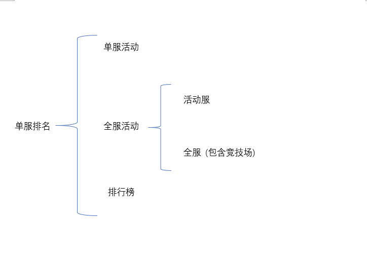
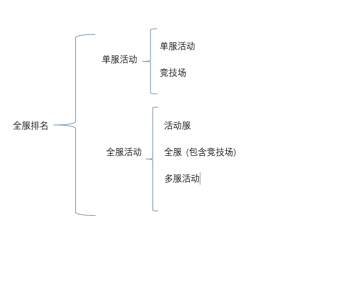

 # 服务器活动排行榜

  
  
  
  ## 火鸡活动 , 单服排名 + 单服活动   
  1. 使用了框架
  2. 存储方式
      + 数据库存储，map缓存
  3. 排行榜
      + 通过map缓存获取。
      + 通过stream sort Comparator.comparingLong 排序。
      + 相同积分，根据积分时间比较
  4.  排期入库
      + 服务启动或刷新配置，只要有新的排期，就会入库。并起线程等待
  5.  排期修改
      + 修改排期，不能删掉原排期。应该把当前排期设置过期，然后加新排期
  6.  排期
        + 尽量使用排期框架
   
 ## 单人活动   单服排名 + 全活动服
  1. 存储方式
      + 数据库存储，map和list 缓存
  2. 积分
      + 阶段积分，map存储。实现Comparable接口。
      + 总积分，list存储。实现Comparable接口。
  3.  排行榜
      + 阶段积分，通过stream.sorted排序。
      +  总积分，每次加积分，Collections.sort排序。
  4.  历史排行榜
      + 每次活动结束，放入数据库
  5. 跨服加积分
      + 通过rmi调用
  6. 问题 
  > 玩家重复出现在排行榜
  ```
        private static SortedSet<UserScore> scoreRankSet = Collections.synchronizedSortedSet(new TreeSet<>());//阶段积分排名
        List<UserScore> list = new ArrayList<>();
        
  		UserScore userScore = new UserScore();
  		userScore.setUid("111111111");
  		userScore.setScore(1L);
  		
  		UserScore userScore1 = new UserScore();
  		userScore1.setUid("222222222");
  		userScore1.setScore(2L);
        // 放入list
  		list.add(userScore);
  		list.add(userScore1);
  
        // 放入map
  		Map<String, UserScore> map = new HashMap<>();
  		for (UserScore score:list) {
  			map.put(score.getUid(), score);
  		}
  		
  		for (int i = 0; i< list.size(); i++) {
  			scoreRankSet.add(list.get(i));
  		}
  		
  		UserScore myScore = map.get("111111111");
  		myScore.setScore(33L);
  		scoreRankSet.add(myScore);
  		System.out.println(scoreRankSet.size());
  ```
  - TreeSet add方法,使用了treeMap的put方法
  ```
   public V put(K key, V value) {
          Entry<K,V> t = root;
          if (t == null) {
              compare(key, key); // type (and possibly null) check
  
              root = new Entry<>(key, value, null);
              size = 1;
              modCount++;
              return null;
          }
          int cmp;
          Entry<K,V> parent;
          // split comparator and comparable paths
          Comparator<? super K> cpr = comparator;
          if (cpr != null) {
              do {
                  parent = t;
                  cmp = cpr.compare(key, t.key);
                  if (cmp < 0)
                      t = t.left;
                  else if (cmp > 0)
                      t = t.right;
                  else
                      return t.setValue(value);
              } while (t != null);
          }
          else {
              if (key == null)
                  throw new NullPointerException();
              @SuppressWarnings("unchecked")
                  Comparable<? super K> k = (Comparable<? super K>) key;
              do {
                  parent = t;
                  cmp = k.compareTo(t.key);
                  if (cmp < 0)
                      t = t.left;
                  else if (cmp > 0)
                      t = t.right;
                  else
                      return t.setValue(value);
              } while (t != null);
          }
          Entry<K,V> e = new Entry<>(key, value, parent);
          if (cmp < 0)
              parent.left = e;
          else
              parent.right = e;
          fixAfterInsertion(e);
          size++;
          modCount++;
          return null;
      }
  ```
   + comparable 实现
  ```
    @Override
      public int compareTo(UserScore o) {
          return o.getScore().compareTo(getScore());
      }
  ```
  
 ## 战场秘宝  单服排名 + 全服活动（包含竞技场）
 1. 使用框架
 2. 存储方式
    + 数据库存储，redis 缓存
 
 3.  加积分
     + 数据表跨服携带
     + 数据表与redis同时存储，并进行同步
 4. redis操作
     + 加积分，使用redis zIncrby(String key, String uid, long addScore)
     + 获取排行榜，redis zRevrangeByScoreWithScores(String key, long max, long min, int offset, int count)
 5. redis key  最好是 key + scheduleId, 然后一周后清除数据


## 采集资源排行榜   排行榜
 1. 存储方式
     - 数据库，redis
 2. 积分
     - 每小时查询sql，存入redis
     - 玩家个人积分，当redis没有，从sql查询，再放入redis
 3. redis操作
     - 放入到有序列表，redis rPush(String key, String... value)
     - 获取排行榜，redis getRangeList(String key, int start, int end)
     - 存入玩家个人信息，hSet(String key, String field, String value)
     - 获取玩家个人信息，hGet(String key, String field)
 4.  排行榜
     - 单服排名，排除跨服玩家
     - 存入数据，是排行榜的两倍
     - 玩家信息查询数据库，联盟信息通过缓存获取
   
 ## 圣诞boss  全服排名 + 单服活动
 1. 使用框架
 2. 存储方式
    + 数据库表、map缓存、
    + 单服redis、全服redis
 3. 积分同步
     + 线程循环，查询数据库，放入全服redis，再把全服数据下拉到本地redis
 4. redis 操作
       + 加入玩家积分：redis zAdd(String key, String member, long score)
       + 获取排行榜：redis zRevrangeByScoreWithScores(String key, long max, long min, int offset, int count)
 5. 活动结束发奖
     + 积分再次同步，然后判断是否全服都已提交，没有，通过线程不断循环。直至全服都已提交数据。获取全服排名，发奖
 6. 排行榜
    + 玩家信息通过shareInfo
    + 联盟信息redis GLOBAL_ALLIANCE_INFO
 7. 全服redis key与单服redis key 最好有区别
 
  ## 军事要塞  全服排名 + 竞技场
  1. 存储方式
      + redis
  2. redis操作
      + 获取玩家 zScore(String key, String member)
      + 加积分redis zIncrby(String key, String member, long score)
      + 获取排行榜redis zRevrangeByScoreWithScores(String key, long max, long min, int offset, int count)
      + 母服获取排行榜  redis getOtherRedis(crossServerId)
  3. 排行榜
      + 玩家信息：shareInfo
      + 联盟信息，加联盟积分时，从缓存获取联盟信息，然后放入redis。
  4. 加积分是同步 
 
 
 ## 世界boss 全服排名 + 活动服
 1. 数据存储
     + 数据库、map缓存
 2. 积分同步
     + 查询数据库，放入全服redis，再把全服数据下拉到本地redis
 3. redis操作
     + 删除 zRem(String key, String member)
     + 新加 zAdd(String key, String member, long score)
     + 获取排行榜 zRangByDesc(String key, long start, long end)
 4. 跨服加积分
     + rmi
     
 ## 战争游戏  全服排名 + 全服
 1. 使用全服框架
 2. 排行榜根据时间排序
     + 设置加积分时间
     + 实现Comparable接口，先比较积分，再比较积分时间
 3. 开启竞技场活动
    服务器初始化
    ```
    GameEngine
    
    private void initGameData() {
    		long start = System.currentTimeMillis();
    		bootUpWorld();
    		logger.info("[server init]  bootUpWorld, {}ms", System.currentTimeMillis() - start);
    
    		// 设置服务器状态
    		serverOpenStatus = isServerOpen();
    
    		// 服务器启动先初始化积分活动相关数据，防止已完成事件积分加不上
    		if (!GameEngine.isActivityServer()) {
    			start = System.currentTimeMillis();
    			ScoreManager.getInstance().init();
    			logger.info("[server init]  ScoreManager.getInstance().init, {}ms", System.currentTimeMillis() - start);
    ```
    活动框架
    
    ```
        protected boolean open() {
            return !GameEngine.isActivityServer();
        }
    ```
    排行榜
    ```
     public void refreshRanking(){
    
            try{
                // 全服都开
                MilitaryCompetitionManger.getInstance().refresh();
                if (GameEngine.isActivityServer()) {
                    return;
                }
                LoggerUtil.getInstance().logBySFS("--------starting refreshing ranking---------");
                LevelRankingService.getInstance().refresh();//优先更新用户等级排行榜，找出被封禁的玩家
                for(IRankingService service: services){
                    if (service == LevelRankingService.getInstance()) {
                        continue;
                    }
                    service.refresh();
                }
    ```
 4. 合服 
    + 历史排名丢弃
    + 玩家排名携带
    + 联盟积分随盟主携带
   
   
 ## 王国活动 全服排名 + 分组排行榜
 1. 存储方式
     + 数据库表，map缓存，redis
 2. 积分同步
     + 查询数据库，放入全服redis，再把全服数据下拉到本地redis
 3. redis操作
     + redis key是 key + groupId
     + 删除 zRem(String key, String member)
     + 新加 zAdd(String key, String member, long score)
     + 获取排行榜 zRangByDesc(String key, long start, long end)
 4. 发奖
     + 起线程，等全部上报完后，再发奖
 5.  加积分是同步
 6.  全服redis key 要与单服有区别
 7.  跨服加积分
     + rmi
   
  