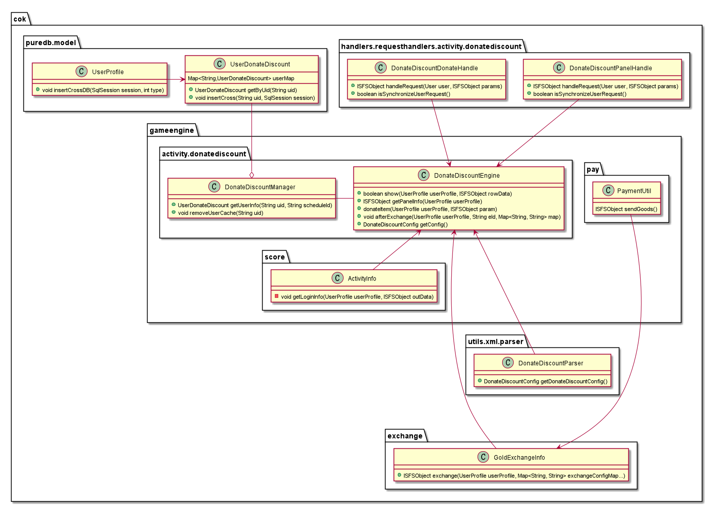

<!--
1.  讲需求


2. 配置表
   活动表 
   activity_panel.xml
3. 数据库表--数据结构
4. 定义接口，贴jira

4. 配置解析
5. 登录下发活动信息
   活动是否开启，活动排期
6. 接口开发 -- 业务逻辑
7. 活动结束处理

10. 框架处理
8. 缓存处理
9. 排名处理


排期   新服排期   常驻  单服排名 全服排名   分组排名    单服活动  全服活动   活动服活动  竞技场活动  数据跨服携带  数据rmi调用  大地图活动     


活动结束临界状态积分或奖励如何处理

准备期
积分排名规则，相同积分，如何排序
滚服
是否支持不同服，不同排期
新兰服配置不同，导致玩家滚服报错
玩家数据是否随排期重置

排期内是否有周期


排期 
   - 全服排期
        - 不同服，不同排期
   - 新服排期
   - 新服期间 是否进入全服排期
   - 常驻
   - 排期结束，临界点处理
   - 准备期
   - 发奖期
   - 排期内分阶段
   - 中途下线
   - 
 全服排期：全服共同使用一个排期
 新服：一般开服30天内，是新服。时间可配置
 新服排期：只对新服生效的排期
 常驻：该活动一直存在
 准备期：活动准备期间
 发奖期：活动结束了，玩家领奖
 排期内分阶段：排期内有多个阶段，或者多轮
 中途下线：由于突发原因，活动下线
 
 
 
 一个简单的活动
    - 一个排期
    - 随排期重置玩家数据
一个充值活动
    - 一个排期
    - 礼包触发
    - 排期结束临界点，
    - 挡位不一致
    - 新服排期
    - 跨服携带
    - 滚服携带
    
一个简单的活动

  - 一个充值排名活动
一个任务活动
  - 一个任务积分排名活动
一个等级奖励活动
一个互换活动
 一个rts活动
 一个目标任务活动
 一个dau活动
 
 一个充值活动
 一个消耗活动
 一个
 
 
 配置的生成
 
 
 
 
充值类活动
   - 活动
 
 
排名
   - 单服排名
   - 全服排名
   - 分组排名
   - 联盟排名
   - 服排名
   排名顺序
      - 相同积分，根据最近一次获取积分的时间排序，先到，排名就靠前
      
    单服排名：一个服进行排名
    全服排名：所有服进行排名
    分组排名：几个服一个组，组内排名
    服排名：  几个服一组或一个服，进行服之间的排名
    
    
    
活动 
   - 单服活动
   - 全服活动
   - 活动服活动
   - 竞技场活动
跨服数据
   - 跨服携带
   - rmi调用
   - 滚服
      - 滚服不携带
      - 滚服携带
      - 新服滚老服，配置不一致，导致玩家数据错误
   - 合服
      - 合服携带
      - 合服不携带
大地图活动
   - 活动开始时刷点
   - 活动结束后，清点
   
玩家数据
   - 数据不清空
   - 排期重置
-->
服 
-
  - 从类型划分，服分为活动服、竞技场、小副本
  - 从时间划分，分为新服和老服。新服时间可配置，默认30天
  
活动
 -
  - 单服活动，玩家数据只在一个服
  - 跨服活动，玩家跨服需要携带
  - 
  
排期
-
   - 全服排期，全服使用一个排期
   - 新服排期，只在新服期间使用，如果新服排期跨度超过新服时间，该排期不会执行
   - 不同服，不同排期
   - 当新服开活动，既有新服排期，又有全服排期。优先走新服排期，再走全服排期。
     - 开关new_server_no_open开启，新服期间也不会走全服排期
   - 对于普通活动
       - 开关new_server_no_open关闭，只要全服排期与新服排期没有交叉，都会执行
       - 开关new_server_no_open开启，只要全服排期与新服排期没有交叉，新服结束后，全服排期会执行
       - 如果想去掉交叉限制，可以在new_server 文件夹下配新服配置
   - 对于框架活动，会有一个原则。不会中途进入排期。其他都一样
      - function_on 关闭，该活动不加载排期
      - 如果排期已经开始，不能删除排期，但可以提前关闭
   - 排期临界点处理，玩家正在完成任务或支付，此时排期结束，需要延迟处理
   - 准备期，活动有一个与预告期，或者报名期
   - 奖励期，活动结束，玩家领取奖励
   - 常驻活动，活动一直会有排期
   - 对所有的请求做一个判断，当前是否有排期。防止排期突然下掉
   - 如果活动数据随排期重置，在排期结束保留玩家数据，以防客诉找不到数据。等新的排期开始再重置
   
   

 玩家数据处理
  -
   - 全服活动，玩家数据跨服携带，或者通过rmi调用
   - 单服/竞技场活动，玩家数据只在一个服，不用跨服携带
   - 在跨服中，由于玩家会携带数据，如果不同服，不同排期，不同配置，可能会导致玩家数据错误。需要处理
   - 滚服/合服，单服活动也需要携带玩家数据
   - 如果是跨服活动，且缓存是活动管理器自己管理的，玩家跨服需要清理缓存。防止玩家来回跨服，缓存数据不是最新的。如果数据在UserProfile 则不需要
   - 如果是全服活动，竞技场会有玩家遗留的数据，不要在服务器启动时候，全部加载玩家缓存。导致玩家跨到竞技场数据丢失 
  
活动排名
-
   - 单服排名，一个服的玩家/联盟数据进行排名
   - 全服排期，需要定时拉去所有服前100名的玩家/联盟数据，然后排名
   - 组内排名，几个服作为一个组，对玩家/联盟排名
   - 王国排名，一个服作为一个单位，全服排名
   - 排名中积分相同的玩家，按照到达该积分的先后顺序排序，
   - 积分要用long，不要使用int，防止积分太大，导致溢出
 
跨服
-
  - 纵深活动，母服到子服A，母服数据不清理。
  - 子服A到子服B，玩家携带数据到子服B, 在子服A的数据会清理
  - 子服B回到母服，玩家覆盖母服以前的数据，子服B也会清除
  - 竞技场活动， 母服到竞技场，母服数据不清理，玩家携带数据到竞技场，覆盖竞技场玩家的信息。
  - 竞技场回母服，竞技场玩家数据保留， 玩家携带数据回母服。
  
大地图活动
-
  - 活动开启，需要全地图刷点
  - 活动结束，需要清理活动点
  - 需要加特殊处理，排期突然下掉，点要清除。运营有时会上错排期，或者其他突发原因

充值活动
-
  - 排期临界点处理，玩家支付比较耗时，此时排期结束，导致支付报错。需要延迟处理
  - 挡位<->礼包<->美元金额<->日元，可以通过gold_price.xml获取
  - 支付过程，如果抛异常，玩家获取不到道具，导致退款。最好做一个兼容处理，例如转换成金币包

配置
- 
  - 排期配置, 
    ```
      <!-- 新服排期  -->
      <Group id="new_server">
          <ItemSpec id="1" start_day="15" end_day="21" config="config1" />
      </Group>
      <Group id="schedule"> 
          <!-- 这条配置，不要加新字段。可以放到base_config 或config ，命名统一key+ 数字，例：config1  -->
          <ItemSpec id="18" start_time="2019/10/01 00:00" end_time="2019/10/06 00:00" base_config="task_pool1" config="config1"/> 
          <ItemSpec id="18" start_time="2019/10/01 00:00" end_time="2019/10/06 00:00" base_config="task_pool2" config="config2"/> 
      </Group> 
    
      <Group id="config1">
          <!-- 分服配置-->
          <ItemSpec id="1#1001-1004" task_config="consume_task1" refresh_config="refresh1" refresh_type="1"/>
          <ItemSpec id="1#3-465|469" task_config="consume_task1" refresh_config="refresh1" refresh_type="1"/>
       </Group> 
       <Group id="config2">
          <ItemSpec id="1" task_config="consume_task1" refresh_config="refresh1" refresh_type="1"/>
       </Group> 
    ```
配置生成
 - 玩家需要
  
 
开发一个活动的类图
-



新服排期与全服排期关系
 -
  ### 用火鸡举例： 
   - resource 文件夹下的：turkey_coming.xml （X1）
   - new_server 文件夹下的：turkey_coming.xml （X2）
   - turkey_coming.xml 里面有排期 group： schedule （S1）、new_server （S2）
   
 - 其中 X1 和 X2 是一个维度的东西，S1 和 S2 是一个维度的东西，S2 和 X2 没有任何关系。
  （X2 中也可以配 S1，但这样配对新服没有意义） X2 中应只配 S2
  ——
   
  ##### X2 和 S2 都是为了新服排期服务的。
  ##### 先理解 X2， 和 S2 新服的区别：
   
  1. 当一个服务器还是新服时，无视 X1 ，只看 X2，当这个新服变成非新服的临界时间点，此时此服配置刷新，切换为只看 X1 无视 X2，所以新服配置可以配置在 X2
   
  2. 当决定 X 后 （X1 or X2），再看 S （S1 or S2）
  如果有 S2，则新服看 S2。新服是否看 S1，决定于开关 new_server_no_open，如果为 1 则不看，如果为 0，则看 S1
  
  ##### new_server_no_open 开关，代表新服会不会跟 S1（ 1，不会跟； 如果 0，会跟）
  ##### 但是新服肯定不会跟一个不完整的排期
   <br/><br/>
   
   
  默认新服排期不会中途进入全服排期：
  1. 只要新服排期配置的是 resource 下 new_server 的 group
   
  新服排期中途进入全服排期的必要条件：
  1. new_server 文件夹下有配置，
  2. resource 下的配置，没有 new_server 的 group  

      
      
   